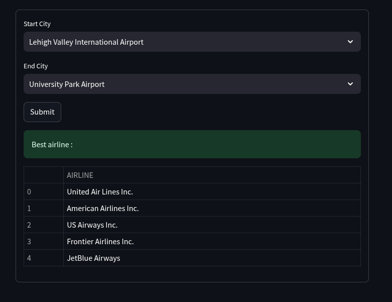
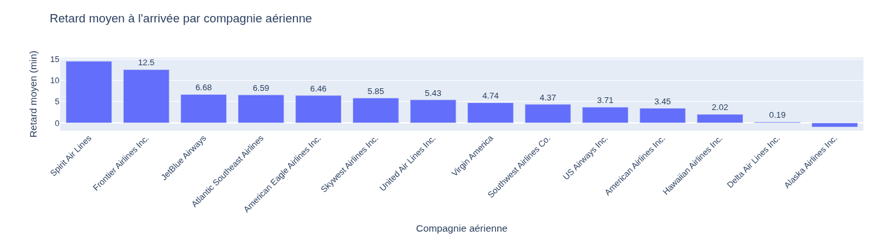
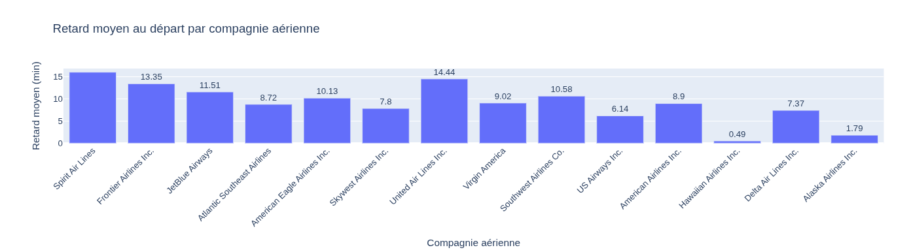
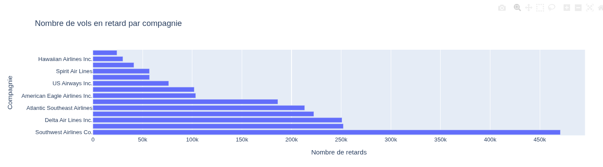
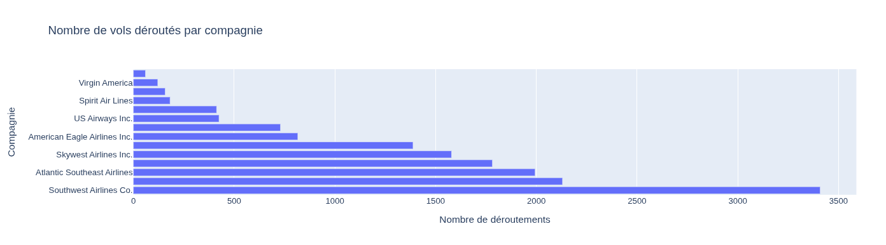
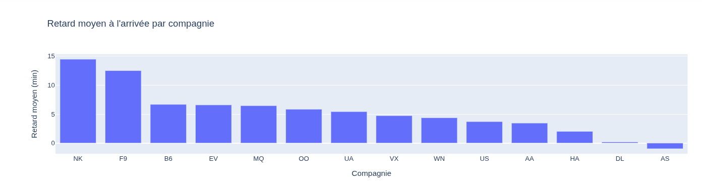
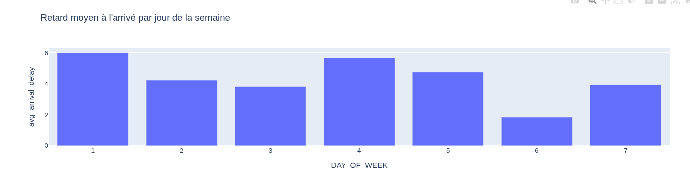
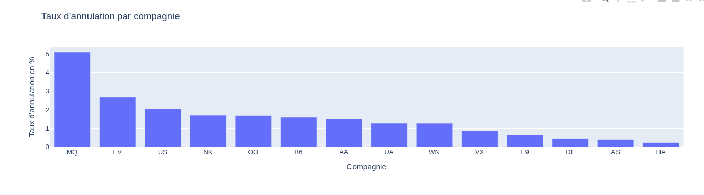

# plane_analytics


## Install dependencies

```bash
pip install -r requirements.txt
```

## Launch apps

```bash
streamlit run src/app/app.py
```



## Launch on docker

- create a folder `data` in `docker/` & put the flights.csv file in it

```bash
cd docker
docker compose up -d 
```
- put the csv in hdfs
```bash
docker compose exec -it namenode bash
hdfs dfs -mkdir -p /user/data
hdfs dfs -put data/flights.csv /user/data
hdfs dfs -put data/airlines.csv /user/data
hdfs dfs -put data/airports.csv /user/data
```

- for parquet always in namenode
```bash
hdfs dfs -chmod 777 /user/data/*
```


## Download csv files 

- put there in docker/data folder

-> https://drive.google.com/file/d/1_8MdG9BOQU-bD-piwHkzz8BbW6TGxVZr/view?usp=sharing
-> https://drive.google.com/file/d/1fJotyuz27E6faTTLuEKJro6mCoQFj0k3/view?usp=sharing
-> https://drive.google.com/file/d/12PD0mk10A0a37cWrGoaQUH-qteXpvnb5/view?usp=sharing


---

## Training new models  

- Go to jupyter notebook at the end

- Generate KPI table
```
	AIRLINE	AIRLINE_NAME	TOTAL_FLIGHTS	AVG_DELAY	DELAY_RATE	ON_TIME_RATE	CANCEL_RATE	SEVERE_DELAY_RATE	FLEET_SIZE	AVG_CANCELS_PER_DAY	IS_RELIABLE
0	UA	United Air Lines Inc.	515723	14.435441	0.225224	0.774776	0.012745	0	721	18.008219	0
1	NK	Spirit Air Lines	117379	15.944766	0.261043	0.738957	0.017073	0	79	5.490411	0
2	AA	American Airlines Inc.	725984	8.900856	0.164544	0.835456	0.015040	0	1044	29.915068	1
3	EV	Atlantic Southeast Airlines	571977	8.715934	0.164384	0.835616	0.026629	0	390	41.728767	1
4	B6	JetBlue Airways	267048	11.514353	0.208873	0.791127	0.016012	0	215	11.715068	0
5	DL	Delta Air Lines Inc.	875881	7.369254	0.134877	0.865123	0.004366	0	828	10.476712	1
6	OO	Skywest Airlines Inc.	588353	7.801104	0.159199	0.840801	0.016929	0	383	27.287671	1
7	F9	Frontier Airlines Inc.	90836	13.350858	0.221872	0.778128	0.006473	0	62	1.610959	0
8	US	US Airways Inc.	198715	6.141137	0.141172	0.858828	0.020466	0	351	22.469613	1
9	MQ	American Eagle Airlines Inc.	294632	10.125188	0.185221	0.814779	0.050996	0	203	41.164384	0
10	HA	Hawaiian Airlines Inc.	76272	0.485713	0.068623	0.931377	0.002242	0	50	0.468493	1
11	AS	Alaska Airlines Inc.	172521	1.785801	0.103889	0.896111	0.003878	0	147	1.832877	1
12	VX	Virgin America	61903	9.022595	0.171720	0.828280	0.008626	0	57	1.463014	1
13	WN	Southwest Airlines Co.	1261855	10.581986	0.201400	0.798600	0.012714	0	704	43.953425	0
```

- you can modify the architecture of the mlp in this step of the notebook
```python
model = tf.keras.Sequential(
    [
        tf.keras.layers.InputLayer(shape=(X_train.shape[1],)),
        tf.keras.layers.Dense(1000, activation="relu"),
        tf.keras.layers.Dense(500, activation="relu"),
        tf.keras.layers.Dense(250, activation="relu"),
        tf.keras.layers.Dense(100, activation="relu"),
        tf.keras.layers.Dense(
            4, activation="sigmoid"
        ),  # 3 outputs : Diverted, Cancelled, Delayed
    ]
)
```

- don't forget to save the model at the end of the notebook and extract to the main of the project
```python
model.save("model.keras")
```


## ANALYTICS

- In the notebook in  `Analytics` section, you can add other plot like this











